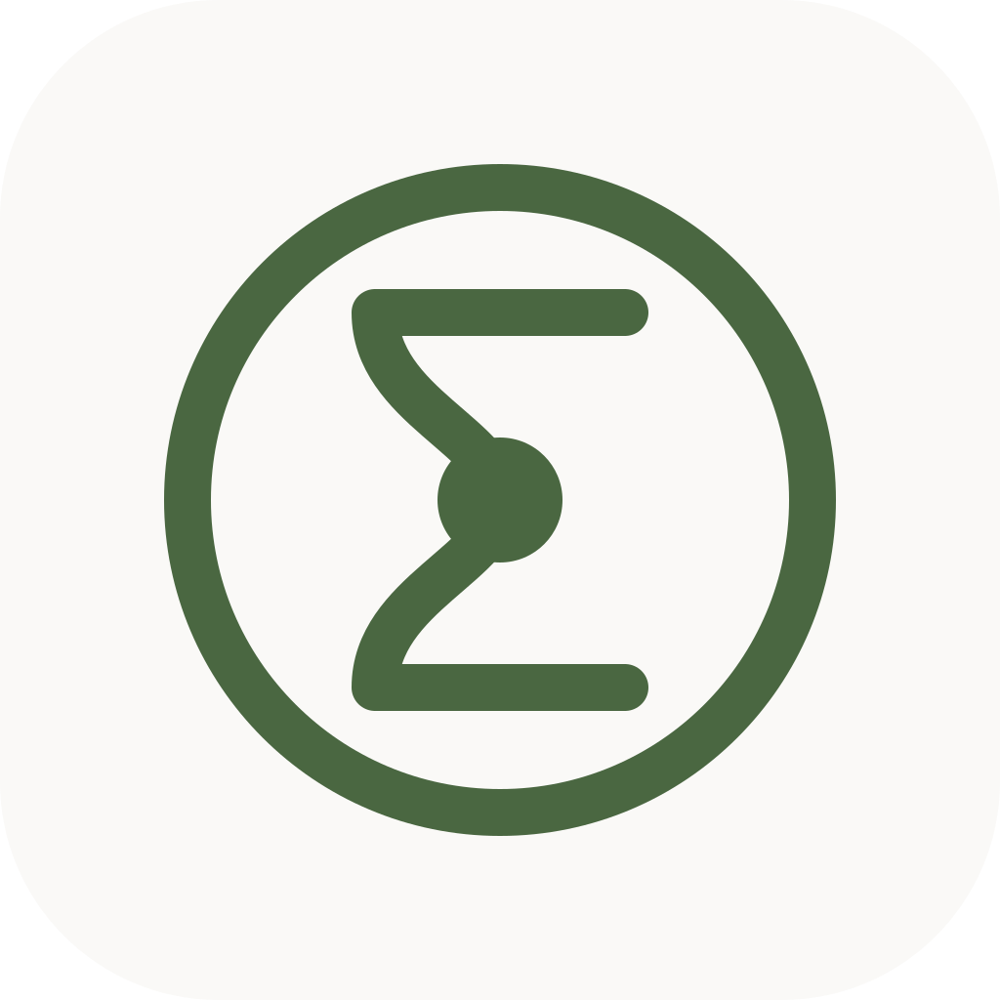

# Kairo

<p align="center">
  
</p>

> A collaborative productivity app that elevates the classic todo list with real-time social features, calendar views, and accessibility-first design.

**Kairo** (from Greek *kairos* - "the opportune moment") helps you manage tasks while staying connected with friends and teammates. See each other's availability, share tasks, and collaborate in real-time.

---

## Features

### Tasks
- Create tasks with title, description, priority, and optional start/end time
- Swipe right to complete / swipe left to delete
- Tap a task to edit
- Visual time progress bar showing remaining time
- Completed tasks section ordered by most recently completed
- Priority filtering (all, urgent, high, medium, low)
- Accurate streak tracking using `completed_at` so only completion day counts

### Calendar
- **Day view**: 24h vertical timeline with task blocks sized by duration
- **Week view**: 2-day side-by-side layout (selected + next day)
- **Month view**: task title previews inside each day cell
- Current time red indicator
- Tap a task to toggle completion
- Navigation arrows + "Today" quick-jump
- See accepted friends' public tasks with due dates on your calendar
- Task block color is the owner's profile or friend color; updates in realtime via Supabase
- Priority shown as a small dot in the top-left corner of day/week blocks
- Avatars of shared-with users shown in the bottom-right of day/week task blocks
- Private friend calendars display "Busy" blocks; public calendars show full task data

### Authentication
- Email sign up / sign in
- Google Sign-In (native iOS flow)
- Session-aware routing

### Social
- Search users by username
- Send, accept, reject and cancel friend requests
- Create tasks with a friend preselected
- Remove friends
- Assign a custom color to each friend; stored per side in `friendships.requester_color` / `addressee_color`

### Profile
- Edit profile (display name, username, avatar URL)
- Calendar visibility (public / private)
- Choose your own task color in a dedicated "My task color" section
- Appearance settings (light / dark / system)
- Notifications preferences (task reminders, friend activity, shared task updates)
- Version tile pulled from package info
- Language switcher to override the app locale from `ProfilePage`

### Onboarding
- 4-step first-launch tour with Skip/Get started
- Only shown once; stored in `SharedPreferences`

### Mascot
- A custom `CustomPainter` cat that reflects your daily momentum
- States: `normal` (pending tasks), `happy` (done for the day), `sad` (no recent progress), `sleeping` (rest day)
- Subtle animations: tail wag, blinking, ear wiggles, falling tear, breathing snot bubble
- Random `MIAU` speech with an animated mouth and particle text

### Focus Mode (ADHD-friendly)
- Pomodoro-style 25-minute focus timer accessible from the dashboard header
- Pick one pending task, start the timer, and minimize distractions
- Pause, reset, and complete the task when the session ends
- 5-minute break timer after each focus session
- Local notification when a session ends

### Soft Persistent Reminders (ADHD-friendly)
- From any task detail sheet, tap "10 / 15 / 30 / 60 min" to schedule a gentle reminder
- Useful for starting tasks when executive function is low
- Cancels the previous reminder for the same task before scheduling a new one
- Localized "Time to start" notification when the time is up

### Internationalization
- Bilingual English/Spanish support using Flutter ARB files (`lib/l10n/app_en.arb`, `lib/l10n/app_es.arb`)
- Generated `AppLocalizations` accessible via `context.l10n`
- Spanish is the default; the user can override it from `ProfilePage`. The device locale falls back to `es` or `en` through `supportedLocales`

### In-App & Push Notifications
- In-app notification history with unread badge in the dashboard `KairoHeader`
- Android: FCM foreground/background messages, token registration, and token refresh
- iOS: push notification toggles are now active (token registration is attempted; remote delivery still requires a paid Apple Developer account for APNs)
- Notification preferences in `Profile` (task reminders, friend activity, shared task updates)
- Tapping a notification navigates to the relevant tab
- Streak notifications: earned, close-to-losing, and lost

### Coming Soon
- Server-side push delivery (needs FCM service account)
- Offline support
- More ADHD/Autism accessibility tools (subtasks, routine templates, energy-based planning)

---

## Tech Stack

| | Technology |
|---|---|
| Mobile | Flutter (iOS + Android) |
| Backend | Supabase (Postgres, Auth, Realtime, Storage) |
| State | BLoC Pattern (flutter_bloc) |
| Architecture | Clean Architecture (feature-first) |
| Navigation | go_router |
| DI | get_it + injectable |
| Push | Firebase Cloud Messaging |
| Version | package_info_plus |
| Internationalization | flutter_localizations + ARB (en/es) |
| Persistence | shared_preferences (onboarding & locale) |

**100% free and open source.** Core services use free tiers.

---

## Getting Started

### Prerequisites

- macOS (Apple Silicon recommended)
- [Xcode](https://apps.apple.com/app/xcode/id497799835) (from App Store)
- [Flutter SDK](https://docs.flutter.dev/get-started/install/macos) (3.47+)
- [CocoaPods](https://cocoapods.org/) (for iOS)

### Quick Setup

```bash
# 1. Clone the repo
git clone https://github.com/listerineh/kairo-tasks.git
cd kairo-tasks

# 2. Create environment file from example
cp .env.example .env
# Edit .env with your Supabase & Google OAuth credentials

# 3. Install Flutter dependencies
flutter pub get

# 4. Run the app (iOS simulator or connected device)
flutter run --dart-define-from-file=.env

# 5. Or build an APK for Android testing
flutter build apk --split-per-abi
```

### Full Environment Setup (from scratch on Mac)

```bash
# Install Homebrew
/bin/bash -c "$(curl -fsSL https://raw.githubusercontent.com/Homebrew/install/HEAD/install.sh)"

# Install Flutter
brew install --cask flutter

# Install CocoaPods
brew install cocoapods

# Install Xcode from App Store, then:
sudo xcode-select --switch /Applications/Xcode.app/Contents/Developer
sudo xcodebuild -runFirstLaunch

# Verify everything
flutter doctor
```

### iOS on Real Device (Free)

You can test on your iPhone without a paid Apple Developer account:

1. Connect iPhone via USB
2. Enable Developer Mode (Settings → Privacy & Security → Developer Mode)
3. Open `ios/Runner.xcworkspace` in Xcode
4. Set Team to your Personal Team (free Apple ID)
5. Run on device

> Note: Free provisioning certificates expire every 7 days.

### Generate APK

```bash
flutter build apk --split-per-abi
# Find APKs in: build/app/outputs/flutter-apk/
```

---

## Project Structure

```
lib/
├── app/          # App config (theme, router, DI)
├── core/         # Shared utilities & base classes
└── features/     # Feature modules
    ├── auth/     # Authentication
    ├── onboarding/ # First-launch tour
    ├── tasks/    # Task management
    ├── calendar/ # Calendar views (day, week, month)
    ├── social/   # Friends & sharing
    ├── notifications/ # Push & in-app
    ├── focus/    # Pomodoro focus mode (ADHD-friendly)
    └── profile/  # User settings
```

Each feature follows Clean Architecture: `domain/` → `data/` → `presentation/`

See [docs/architecture.md](docs/architecture.md) for full details.

---

## Documentation

| Document | Description |
|----------|-------------|
| [AGENTS.md](AGENTS.md) | Project conventions & development guidelines |
| [docs/design.md](docs/design.md) | Design system, tokens, component patterns |
| [docs/architecture.md](docs/architecture.md) | Technical architecture & data flow |
| [CHANGELOG.md](CHANGELOG.md) | Version history |

---

## Contributing

We welcome contributions! This project is built to be accessible to developers of all levels.

### How to Contribute

1. **Fork** the repository
2. **Create a branch**: `git checkout -b feature/my-feature`
3. **Follow the conventions** in [AGENTS.md](AGENTS.md)
4. **Write tests** for new functionality
5. **Run checks**: `flutter analyze && flutter test`
6. **Submit a PR** with a clear description

### Guidelines

- Follow the [design system](docs/design.md) for any UI changes
- Follow the [architecture patterns](docs/architecture.md) for new features
- Keep accessibility in mind (44px touch targets, contrast ratios, semantic labels)
- Update CHANGELOG.md with your changes
- One feature/fix per PR

---

## Roadmap

- [x] V 01.00 - Project setup, tasks UI
- [x] V 01.01 - Supabase integration (auth + database)
- [x] V 01.02 - Calendar views (day, week, month)
- [x] V 01.03 - Social features (friends, public calendars, friend colors)
- [x] V 01.04 - Real-time collaboration + shared tasks, onboarding, and in-app locale
- [x] V 01.05 - Push notifications, in-app notifications, iOS toggles, and streak notifications
- [x] V 01.06 - Focus Mode Pomodoro timer (first ADHD accessibility tool)
- [x] V 01.07 - Soft persistent reminders from TaskDetailSheet
- [ ] V 01.08 - Offline support
- [ ] V 01.09 - More ADHD/Autism accessibility tools

---

## License

MIT License - see [LICENSE](LICENSE) for details.

---

## Acknowledgments

- Design inspired by editorial typography and calm computing principles
- Built with accessibility in mind, informed by neurodiversity research
- Powered by the incredible Flutter and Supabase communities
